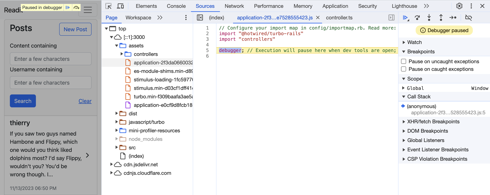

# Debugging in Ruby on Rails with the `debug` Gem

## Introduction to Debugging
Now we're going to delve into debugging - a critical skill for every developer. We'll use the [debug](https://github.com/ruby/debug) gem, a robust tool for diagnosing and resolving issues in Ruby on Rails applications.

## Why Debugging Matters
Debugging is the process of identifying and fixing errors or bugs in your code. It's crucial for making sure your applications run smoothly and behave as expected. Up to now you've likely used `puts`, `pp`, or other logging techniques to help 'make the invisible visible' and resolve bugs in your code. The [debug](https://github.com/ruby/debug) gem provides a way to inspect your code execution, examine variables, and control the flow to understand exactly what's happening at any point.

<aside>
  The origin of the term "debugging" is often attributed to Admiral Grace Hopper who found a literal bug while working on a Mark II computer at Harvard University in the 1940s. However, usage of the term traces back as far as 1878 in a letter written by Thomas Edison. [Source](https://www.computerworld.com/article/2515435/moth-in-the-machine--debugging-the-origins-of--bug-.html)
</aside>

## Setting Up the debug Gem
Before we start, ensure the debug gem is included in your Rails project:

Add the gem to your Gemfile:

```ruby
gem 'debug', group: :development
```

Run `bundle install` to install the gem.

With that set up, you're ready to begin debugging!

## Debugging with `debugger` Alias
In Ruby, `binding.break` is a method used to initiate a debugging session. However, there's a more commonly used alias: `debugger`. This alias works exactly the same way and is preferred by many developers for its brevity and clarity.

<aside>
The `debug` gem provides several aliases for initiating a debugging session, including `binding.break`, `binding.b` and `debugger`. You can use whichever you prefer; they all provide the same functionality.
</aside>

## Using `debugger` in a Rails Application
Suppose we have a Rails application with a `Post` model. We're encountering issues with creating a post. You suspect the issue lies in the create action of the `PostsController`. By placing `debugger` in this action, you can inspect the `@post` object and step through the code to identify where things go wrong.

```ruby
class PostsController < ApplicationController
  def create
    @post = Post.new(post_params)
    debugger # Debugging starts here
    if @post.save
      redirect_to @post
    else
      render :new
    end
  end
end
```

Once your app evaluates the `debugger` statement, it'll enter the debugging session:

```
Processing by PostsController#create as HTML
[2, 11] in ~/projects/rails-guide-example/app/controllers/posts_controller.rb
     4|
     5|   def create
     6|     @post = Post.new(post_params)
=>   7|     debugger
     8|     if @post.save
     9|       redirect_to @post
    10|     else
    11|       render :new
    12|     end
    13|   end
    14|
=>#0    PostsController#create at ~/projects/rails-guide-example/app/controllers/posts_controller.rb:7
  #1    ActionController::BasicImplicitRender#send_action(method="index", args=[]) at ~/.rbenv/versions/3.0.1/lib/ruby/gems/3.0.0/gems/actionpack-7.1.0.alpha/lib/action_controller/metal/basic_implicit_render.rb:6
  # and 72 frames (use `bt' command for all frames)
(rdbg)
```

## Navigating the debugging Session
When your Rails server hits the debugger line, it will pause, and you'll enter the debug mode in your console. Here's how to navigate:

- `step` or `s`: Move to the next line of code, stepping into methods.
- `next` or `n`: Move to the next line without stepping into methods.
- `continue` or `c`: Resume normal execution until the next breakpoint.
- `vars`: Display local variables and their values.
- `p <expression>`: Evaluate and print any Ruby expression.

## Advanced Debugging Techniques
- **Conditional Breakpoints**: Set breakpoints that trigger under specific conditions, like `debugger if params[:debug]`.
- **Watching Variables**: Use `watch @post` to monitor changes in the @post variable.
- **Backtrace Inspection**: Use `backtrace` to view the call stack and understand how the code reached the current point.

## Debugging Views and Partials
You can also debug views in Rails:

```erb
<%# app/views/users/new.html.erb %>
<%= form_with model: @user do |form| %>
  <% debugger %>
  <%= form.label :name %>
  <%= form.text_field :name %>
  ...
<% end %>
```

When this view is rendered, the debugger will pause, allowing you to inspect the state of your view, including any instance variables like @user.

## JavaScript Debugging in Rails
It's also essential to know how to debug JavaScript, especially in modern web applications where client-side scripting plays a significant role. Here, we'll cover how to set breakpoints in JavaScript within a Rails application.

### Setting Up for JavaScript Debugging
In a Rails application, JavaScript files are typically located in the `app/javascript` directory. To debug these files, you'll use the developer tools available in most modern browsers like Chrome, Firefox, or Edge.

### Creating a Breakpoint in JavaScript
To create a breakpoint in JavaScript, you can use the `debugger` statement. When the browser's developer tools are open, this statement will pause the execution of your JavaScript code, allowing you to inspect variables, step through the code, and understand the flow of execution.

Here's an example of how to use it:

Open your JavaScript file in the Rails app. For instance, `app/javascript/application.js`.

Add the debugger statement in the code where you want to pause execution. For example:

```javascript
debugger; // Execution will pause here when dev tools are open
// ... rest of your JavaScript code ...
```

Open your Rails application in a web browser and ensure the developer tools are open. You can usually open them by right-clicking the page and selecting "Inspect" or pressing Ctrl+Shift+I (or CMD⌘+OPT⌥+I on Mac).

Interact with your application to trigger the JavaScript code. The execution will pause at the debugger statement.



### Navigating the Browser's Debugging Tools
When the execution is paused at a breakpoint:

- You can inspect and modify the values of variables.
- Step through the code using the step over, step into, and step out buttons.
- View the call stack to see the function call sequence that led to the breakpoint.
- Evaluate expressions in the console.

### Tips for Effective JavaScript Debugging
- **Test in Multiple Browsers**: Different browsers have different developer tools and JavaScript engines. If you're encountering a browser-specific issue, make sure to debug in that particular browser.
- **Utilize Console Logs**: Alongside breakpoints, judicious use of console.log() can provide valuable insights into the state of your application at various points.
- **Check for JavaScript Errors**: The browser's console will display JavaScript errors, which can be crucial clues in diagnosing problems.

## Practice Exercise: Debugging a Rails Application
Now, let's put your new debugging skills into practice. Follow these steps in your existing Rails project:

- Identify a feature or a bug in your application where you suspect an issue.
- Insert `debugger` at a strategic location in your code.
- Interact with your application to trigger the debugger.
- Use the debug console to inspect variables, step through the code, and diagnose the issue.
- Once you've identified the problem, make the necessary corrections in your code.

---

- Have you tried using `debugger` in one of your Rails projects or assignemnts to trigger a breakpint?
- Yes
  - Great! Remember to keep this tool handy when debugging your applications.
- No
  - Please try inserting a `debugger` breakpoint before continuing. 
{: .choose_best #debugger_session title="Have you tried using debugger?" points="1" answer="1"}

## Quiz

- What is the primary purpose of debugging?
- To write more code.
  - Not correct. Debugging is focused on identifying and fixing errors in the code.
- To improve code readability.
  - Not correct. While debugging can indirectly improve readability, its main focus is on fixing errors.
- To identify and fix errors or bugs in the code.
  - Correct! Debugging helps ensure that applications run smoothly and behave as expected.
{: .choose_best #purpose_of_debugging title="Purpose of Debugging" points="1" answer="3"}

- Which command can be used to move to the next line of code without stepping into methods during a debugging session?
- `step`
  - Not correct. The step command moves to the next line, stepping into methods.
- `next`
  - Correct! The next command moves to the next line without stepping into methods.
- `continue`
- Not correct. The continue command resumes normal execution until the next breakpoint.
{: .choose_best #next_command title="Next Command in Debugging" points="1" answer="2"}

- What does the vars command do in a debugging session?
- It displays local variables and their values.
  - Correct! The vars command shows the current state of variables in scope.
- It exits the debugging session.
  - Not correct. The vars command displays local variables and their values.
- It lists all available debugging commands.
  - Not correct. The help command lists available debugging commands.
{: .choose_best #vars_command title="Vars Command in Debugging" points="1" answer="1"}

- The debug gem provides several aliases for initiating a debugging session, including binding.break, binding.b, and debugger.
- True
  - Correct! These aliases all provide the same functionality to start a debugging session.
- False
  - Not correct. These aliases are indeed provided by the debug gem.
{: .choose_best #debug_aliases title="Debug Gem Aliases" points="1" answer="1"}

- You can set breakpoints in JavaScript within a Rails application by using the debugger statement.
- True
  - Correct! The debugger statement pauses the execution of JavaScript code when the developer tools are open.
- False
  - Not correct. The debugger statement is used for setting breakpoints in JavaScript.
{: .choose_best #javascript_debugger title="JavaScript Debugger Statement" points="1" answer="1"}

<!-- Possible answers: Inspect code execution, examine variables, control code flow, identify and fix errors more effectively. -->
- Name one benefit of using the debug gem for debugging in Ruby on Rails.
{: .free_text #benefit_of_debug_gem title="Benefit of Using the Debug Gem" points="1"}

## Conclusion and Next Steps
You've now learned the essentials of debugging in Ruby on Rails using the `debug` gem and the `debugger` alias. Remember, effective debugging is key to developing reliable and efficient applications.

## Further Learning
- **Explore More Commands**: The debug gem offers a wide array of commands and capabilities. Spend time experimenting with them to understand their full potential.
- **Debugging in Different Environments**: While we focused on the development environment, remember that you can also use debugging in testing. It can be particularly helpful for understanding why a test is failing.
- **Integrate Debugging with Your IDE**: Many Integrated Development Environments (IDEs) offer built-in support or plugins for Ruby debugging. Explore how to connect the debug gem with your IDE for a seamless debugging experience. [Here are details on how you can set that up in VSCode](https://code.visualstudio.com/docs/editor/debugging)
- Read the [Official Guide on debugging Rails applications](https://guides.rubyonrails.org/debugging_rails_applications.html)

## Final Exercise
Try adding a new feature or fixing a complex bug in your application. Use the debugger to step through the entire flow of the feature or bug fix. This exercise will give you deeper insights into the interactions within your Rails application and enhance your problem-solving skills.

Happy debugging! 🪰
